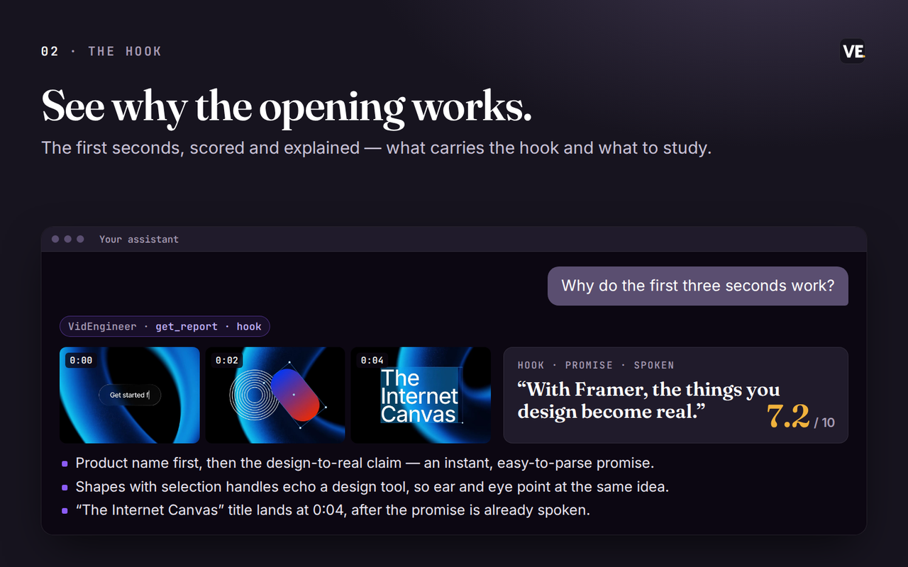

# VidEngineer for your assistant

**Decide what video to make next.** Tell your assistant what you are launching, who it is for and what you can
shoot. VidEngineer finds the right references, studies them with your go-ahead, and gives you one clear
recommendation, the evidence behind it and the next thing to test.

This repo is the plugin package for Claude Code and Codex. It contains the Claude Code marketplace manifest, a
built-in **video strategist** skill, and Cursor packaging for the upcoming Cursor listing. The work runs on VidEngineer's hosted connector
(`https://mcp.videngineer.com/mcp`), and you sign in with your VidEngineer account.

## What it does

| | |
|---|---|
| **Starts from your goal** | The strategist asks a few short questions first: goal, audience, format, deadline, what you can shoot and what you've already tried. It only asks for what you haven't said. |
| **Searches your Library first** | It looks through your own analyses and saved folders before anything else. If nothing fits, it offers relevant videos from VidEngineer's public study library and explains why each one fits. |
| **Asks before it spends** | It tells you which videos are already analysed and which need a new analysis, and asks before it uses anything from your plan. Reopening a cut brief you already have is free. |
| **Breaks videos down** | Every cut, the hook, the transcript, who is on screen, the voice, the music and the sound, scene by scene. An analysis takes about a minute and a half. |
| **Ends on a decision** | Every job ends with a recommendation, what it rejected and why, the evidence with links, what would change the call, and the next test. |
| **Keeps the plan** | You always get the answer in chat. On paid plans you can also save it to a VidEngineer board and pick it up later. Every result links back to VidEngineer. |

<p align="center"></p>

<sub>Real VidEngineer output: the hook report for Framer's “That's Framer” film, read through this connector.</sub>

### Links it accepts

YouTube, TikTok, Instagram, Vimeo, X, Google Drive (shared so anyone with the link can view), and direct video
files (.mp4, .mov, .webm and similar).

Meta Ad Library, Facebook, Foreplay and Motion links are not accepted. Use the same video from one of the
sources above.

## Try it

```text
I'm launching [product] in three weeks. What film should I make?
```
```text
Study these five competitor ads and tell me which angle we should test first: <links>
```
```text
Compare these two openings and tell me which one to test: <link> <link>
```
```text
Critique my draft before launch. What should I fix first? <link>
```
```text
Pick up where we left off on the [launch or client] board. What should we test next?
```
<sub>Boards are on paid plans. On other plans, paste your last decision and it picks up from there.</sub>

The strategist's rules and its eight playbooks are in
[`skills/video-strategist/SKILL.md`](skills/video-strategist/SKILL.md), so you can read exactly how it works.

## Install

**Claude Code**
```text
/plugin marketplace add dherealmark289/videngineer-plugin
/plugin install videngineer@videngineer
```
Sign in through the browser when prompted. The VidEngineer tools and the video strategist skill then appear in
your session.

**Codex CLI**
```sh
codex plugin marketplace add dherealmark289/videngineer-plugin
codex plugin add videngineer@videngineer
```
Or connect the hosted server directly: `codex mcp add videngineer --url https://mcp.videngineer.com/mcp`, then
`codex mcp login videngineer` to sign in. `codex mcp list` shows configured servers; start a session to see the tools.

**Claude (claude.ai and desktop)**: Settings → Connectors → Add custom connector →
`https://mcp.videngineer.com/mcp`. A custom connector gives you the tools but not the strategist skill, so start
with a prompt that asks for intake first and a decision at the end.

**ChatGPT**: coming soon.

**Cursor and Grok**: coming soon.

## Privacy and permissions

Analyses run on VidEngineer's servers and are stored in your own VidEngineer workspace. You sign in over OAuth.
Reading your library, starting analyses, writing cut briefs and editing boards are separate permissions you
grant individually, and you can disconnect at any time. Starting an analysis fetches the video from the link you
give it. Deleting a board is labelled as destructive, and deleted boards can be restored in the app.

[Privacy policy](https://videngineer.com/privacy) · [Terms](https://videngineer.com/terms) ·
[Connector docs](https://docs.videngineer.com/agents/connector-api) · [videngineer.com/mcp](https://videngineer.com/mcp)

## License

MIT. See [LICENSE](LICENSE).
