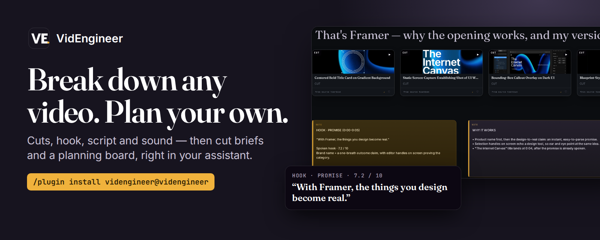
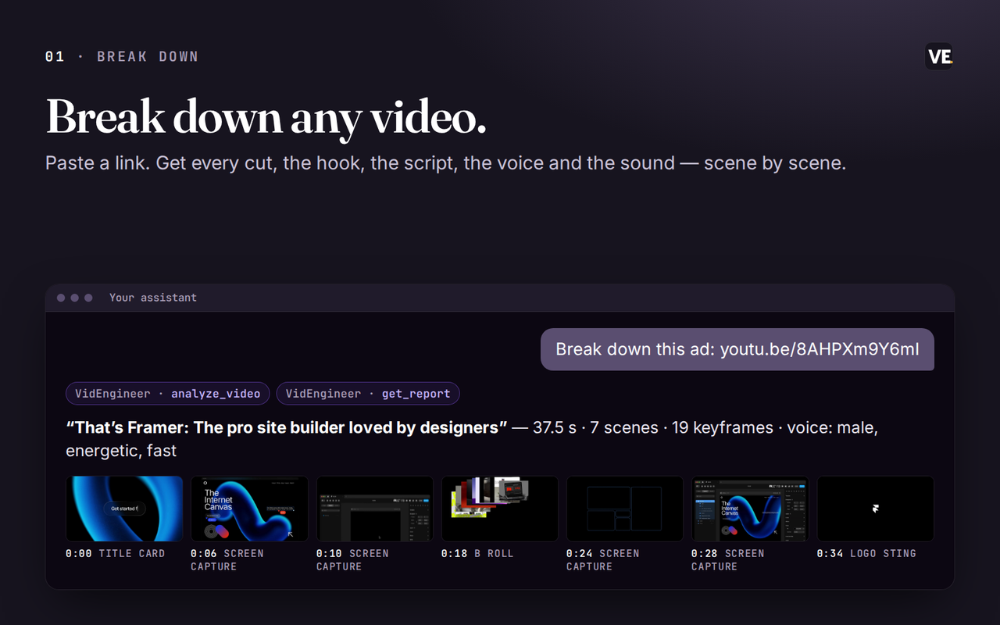
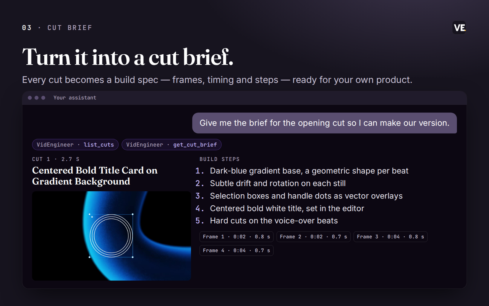
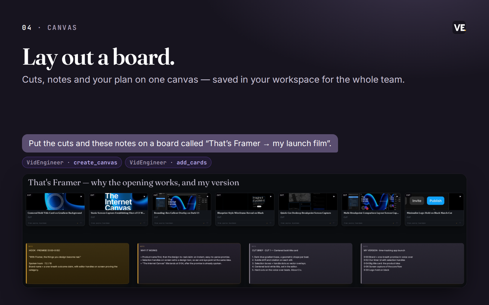

<p align="center"></p>

# VidEngineer for your assistant

Break down any video scene by scene — every cut, the hook, the transcript, the voice, the music and the
sound — then turn it into cut briefs and a planning canvas, right inside your assistant.

This repo is the plugin package for Claude Code and Codex, plus the Claude Code marketplace manifest. The work
happens on VidEngineer's hosted connector (`https://mcp.videngineer.com/mcp`). You sign in with your existing
VidEngineer account.

## What it does

| | |
|---|---|
| **Break down a video** | Paste a link from YouTube, TikTok, Vimeo or X, or a direct video file. You get every cut, the hook, the transcript, who is on screen, the voice, the music and the sound effects. A breakdown takes about a minute and a half. |
| **See why the opening works** | The first seconds, scored and explained: what carries the hook and what to study. |
| **Turn it into a cut brief** | Any cut becomes a build spec with frames, timing and steps that you can use as the blueprint for your own product. |
| **Lay out a board** | Put cuts, notes and your plan on a VidEngineer canvas. Boards live in your workspace, so your team sees the same plan in the app. |
| **Find past work** | List your breakdowns, folders and boards, and pick up where you left off. |

<p>




</p>

<sub>Every screen above is real VidEngineer output: a breakdown of Framer's “That's Framer” film, its hook
report, the brief for its opening cut, and the board built from them through this connector.</sub>

## Try it

```text
Break down this ad and tell me why the first three seconds work: <link>
```
```text
Turn this launch video into a shot-by-shot brief for my own product
```
```text
Show my latest breakdowns and open the canvas for the newest one
```

## Install

**Claude Code**
```text
/plugin marketplace add dherealmark289/videngineer-plugin
/plugin install videngineer@videngineer
```
Sign in through the browser when prompted, then the VidEngineer tools appear in your session.

**Codex CLI**
```sh
codex plugin marketplace add dherealmark289/videngineer-plugin
codex plugin add videngineer@videngineer
```
Or connect the hosted server directly: `codex mcp add videngineer --url https://mcp.videngineer.com/mcp`, then
`codex mcp login videngineer` to sign in. `codex mcp list` shows configured servers; start a session to see the tools.

**Claude (claude.ai and desktop)** — Settings → Connectors → Add custom connector →
`https://mcp.videngineer.com/mcp`.

**ChatGPT** — coming soon.

## Privacy and permissions

Breakdowns run on VidEngineer's servers and are stored in your own VidEngineer workspace. You sign in over
OAuth; reading your library, starting breakdowns, writing cut briefs and editing canvases are separate
permissions you grant individually, and you can disconnect at any time. Starting a breakdown fetches the video
from the link you give it. Deleting a board is labelled as destructive, and deleted boards can be restored in
the app.

[Privacy policy](https://videngineer.com/privacy) · [Terms](https://videngineer.com/terms) ·
[Connector docs](https://docs.videngineer.com/agents/connector-api) · [videngineer.com/mcp](https://videngineer.com/mcp)

## License

MIT — see [LICENSE](LICENSE).
